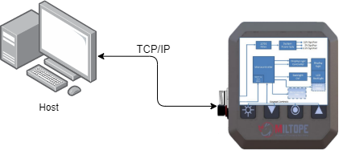

System Overview
===============

This page will provide an overview of the system if their are multiple components to it. A component is any seperate code project within the project. In this example there is a mobile app and an embedded firmware component.

If there is only a single software component to the project, this page is not needed.

    provide a diagram of the system

Components 
==========

.. toctree::
    :maxdepth: 3

    embedded/embedded 
    mobile_app/mobile_app
