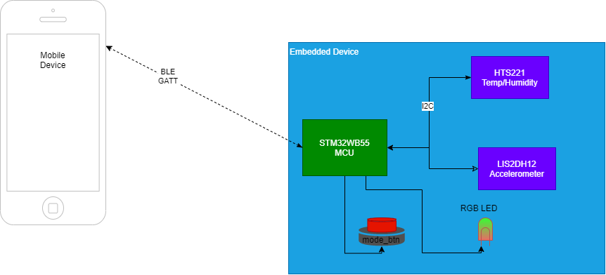

System Overview
===============

This page will provide an overview of the system if there are multiple components to it. A component is any seperate piece of software within the complete system. In this example there is a mobile app and an embedded firmware component.

If there is only a single software component to the project, this page may not be needed.

    provide a diagram of the system (this one was created with the `draw.io extension for VS Code <https://marketplace.visualstudio.com/items?itemName=hediet.vscode-drawio>`_)

Components 
==========

.. toctree::
    :maxdepth: 3

    embedded/embedded 
    mobile_app/mobile_app

.. raw:: latex

    \newpage
